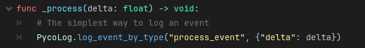

# Pycolitycs Godot Client - Event Analytics
A Godot plugin for interfacing with [pycolytics](https://github.com/KerekesDavid/pycolytics), a tiny open source event logging webservice. It provides anonymized event logging with as little as a single function call.

I made [pycolytics](https://github.com/KerekesDavid/pycolytics) so I could collect anonymized game usage statistics with the least amount of hassle possible. No quotas, no monthly fees, no bloated software, no megacorporation spying on my user's data.

## Getting Started
- Install [pycolytics](https://github.com/KerekesDavid/pycolytics) on a local machine, or a remote server. 
- Install this addon by copying the addons folder in this repository into your project root folder. (Coming to the Godot asset library soon!)
- Enable the pycolytics-godot under `ProjectSettings/Plugins`
- Use `PycoLog.log_event(...)` to log your events.

For more examples, see [examples/example.gd](example/example.gd), or open up [example.tscn](example/example.tscn) in Godot!

## Key Features
- __Event properties are resources:__ You can export them, reuse them, set them from the editor!
- __Automatic batched submission:__ Minimal performance impact.
- __Autoload included:__ For convinient logging.
- __Built-in startup and shutdown events.__ With customizable callbacks.
- __Automatic user-id and session-id generation.__

## Contibuting
Open an issue if you wish to contribute, or buy me a coffee if you find my work useful.

## License
This project is licensed under the MIT License - see the [LICENSE](LICENSE) file for details.
